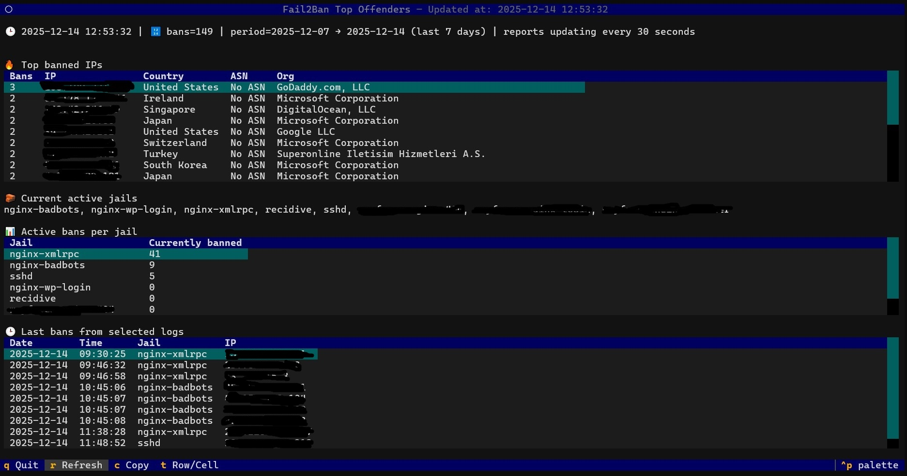

# Offenders (Fail2Ban TUI)

A **Textual**-based terminal UI (TUI) that reads Fail2Ban logs and shows:

- **Top banned IPs** (count + country + ASN/Org)
- **Current active jails**
- **Active bans per jail**
- **Last bans** from the selected log period

Designed for Linux servers running Fail2Ban (e.g. Ubuntu).

## Screenshot



## Requirements

- Python **3.10+**
- Fail2Ban installed and logging to:
  - `/var/log/fail2ban.log` (plus rotated logs)
- Ability to run `fail2ban-client` (the app uses `sudo fail2ban-client ...`)

### Python dependencies

This project depends on:

- `textual`
- (optional) `geoip2` — only if you want Python-based MMDB lookups; otherwise the app falls back to `mmdblookup` if present.

Install from `requirements.txt`:

```bash
python3 -m venv .venv
source .venv/bin/activate
pip install -r requirements.txt
```

Optional:

```bash
pip install geoip2
```

## GeoIP / ASN database files (required for enrichment)

This app **does not download GeoIP/ASN data**. It expects **pre-downloaded** MaxMind-style **MMDB** files on the host.

By default, the script reads these stable filenames:

```python
GEO_COUNTRY_DB = "/usr/share/GeoIP/dbip-country-lite.mmdb"
GEO_ASN_DB     = "/usr/share/GeoIP/dbip-asn-lite.mmdb"
```

If the files are missing, the UI still runs, but the country/ASN fields will show fallback values like **"Unknown"** / **"No ASN"**.

### Included updater script (DB-IP Lite)

This repo includes a helper script to download and refresh the free **DB-IP Lite** databases monthly and maintain stable symlinks:

- `scripts/update-geoip-dbip.sh`

What it does:

- downloads the monthly `.mmdb.gz` files (Country + ASN) from DB-IP
- decompresses them
- moves them into `/usr/share/GeoIP`
- updates these symlinks so the Python app can always read consistent paths:
  - `/usr/share/GeoIP/dbip-country-lite.mmdb`
  - `/usr/share/GeoIP/dbip-asn-lite.mmdb`

**Prereqs:** `wget`, `gunzip`, `sudo` privileges to write into `/usr/share/GeoIP`.

#### Install / run manually

```bash
chmod +x scripts/update-geoip-dbip.sh
./scripts/update-geoip-dbip.sh
```

Sanity check:

```bash
ls -lh /usr/share/GeoIP/dbip-*.mmdb
readlink -f /usr/share/GeoIP/dbip-country-lite.mmdb
readlink -f /usr/share/GeoIP/dbip-asn-lite.mmdb
```

#### Run monthly via cron

Example cron entry (runs on the 1st day of each month at 03:10):

```cron
10 3 1 * * /path/to/repo/scripts/update-geoip-dbip.sh >/dev/null 2>&1
```

If you prefer `@monthly`, that works too:

```cron
@monthly /path/to/repo/scripts/update-geoip-dbip.sh >/dev/null 2>&1
```

DB-IP Lite downloads page: <https://db-ip.com/db/lite.php>

## Running

```bash
python offenders.py
```

(Replace `offenders.py` with your actual script filename.)

### Avoid sudo password prompts

Because the app calls `sudo fail2ban-client ...`, you’ll typically want to allow passwordless access for `fail2ban-client` via `sudoers`.

Edit safely with `visudo` and add something like:

```text
stef ALL=(ALL) NOPASSWD: /usr/bin/fail2ban-client
```

Adjust the username and path to `fail2ban-client` as needed:

```bash
which fail2ban-client
```

## Configuration

Edit these constants in the script:

- `TOP_COUNT` — number of offenders to show
- `LOOKBACK_DAYS` — how many days of bans to include (`0` = all logs)
- `IGNORE_PRIVATE` — skip private/loopback/link-local IPs
- `CHECK_INTERVAL_SECONDS` — refresh interval

## License

MIT — see [LICENSE](LICENSE).
