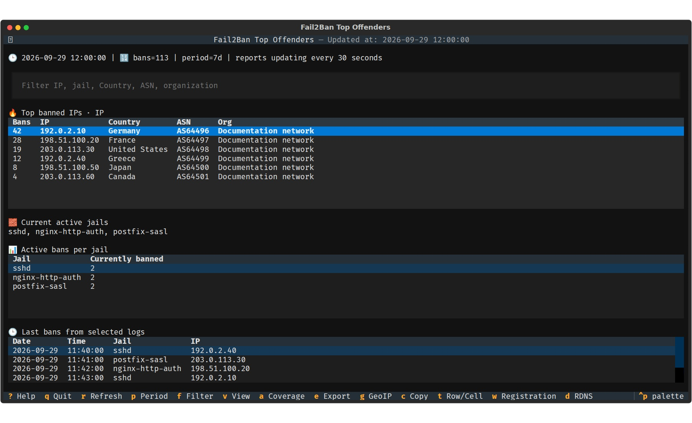

# Offenders (Fail2Ban TUI)

A **Textual**-based terminal UI (TUI) that reads Fail2Ban logs and shows:

- **Top banned IPs** (count + country + ASN/Org)
- **Current active jails**
- **Active bans per jail**
- **Last bans** from the selected log period
- **WHOIS / RDNS** for the currently selected IP (via system tools)

Designed for Linux servers running Fail2Ban (e.g. Ubuntu).

## Screenshot



## Requirements

- Python **3.12+**; the supported server/development baseline is Ubuntu **24.04 LTS** with Python **3.12**.
- Fail2Ban **>= 1.0.2** installed separately (production baseline: **1.0.2**;
  compatibility currently qualified against the 1.0.x and 1.1.x status contracts
  used by Offenders) and logging to:
  - `/var/log/fail2ban.log` (plus rotated logs)
- Ability to run `fail2ban-client` (the app uses `sudo -n fail2ban-client ...`)

### Python dependencies

This project depends on:

- `textual>=8.2.8,<9` (the supported Textual 8 release line)
- `maxminddb>=3.1,<4` — direct generic MMDB reads, including a pure-Python backend;
  no system lookup binary is needed.

From the repository root, install into a virtual environment (on Ubuntu, install
`python3-venv` first if needed). `pyproject.toml` owns the dependency bounds:

```bash
python3 -m venv .venv
source .venv/bin/activate
python -m pip install -e .
```

A base install includes the reader but does not download databases. For a non-editable installation,
use `python -m pip install .`; `python -m pip install -r requirements.txt` remains
a compatible alternative. Editable installation keeps changes to the documented
configuration constants effective when running the installed command.

## System tools (optional but recommended)

These are used for enrichment and convenience actions:

- `whois` (optional) — enables the **WHOIS** popup (`w`)
- `dig` (optional) — enables better **RDNS** output (`d`), otherwise the app falls back to `getent hosts`

On Ubuntu:

```bash
sudo apt-get update
sudo apt-get install -y whois dnsutils
```

## GeoIP / ASN database files (required for enrichment)

GeoIP enrichment is optional. Run these commands as your normal user:

```bash
offenders                       # unchanged dashboard launch
offenders geoip status          # read-only local health, policy, last outcome
offenders geoip update          # explicit network download and activation
offenders geoip auto on         # opt in to future automatic checks
offenders geoip auto off        # default; disable future automatic checks
```

Data lives in `$XDG_DATA_HOME/offenders/geoip`, or
`~/.local/share/offenders/geoip` when unset. No sudo, cron, package installation,
or system service change is needed. Run the CLI and dashboard with the same XDG
environment. There is no arbitrary URL or system-target override.

The updater streams Country and ASN from the fixed DB-IP Lite HTTPS source.
Only a 404 permits falling back to the previous month, always for the whole pair.
Connection and individual socket reads have a 30-second timeout; each download
is limited to 128 MiB compressed and 512 MiB decompressed. Redirects are rejected.
Malformed/truncated gzip and invalid or wrong-role MMDBs fail before activation.

Validated data is installed in `generations/YYYY-MM-<unique-id>/`; one atomic
`current` symlink replacement activates both files. Updates hold a Linux advisory
writer lock. Readers continue using the previous files during acquisition and
refresh against the new generation on the next report, without restarting.
Current and the immediately previous complete generation are retained; only
older complete engine-owned generations are pruned after activation. Failed
acquisition leaves the previous active generation untouched. An activation that
succeeds but encounters housekeeping failure is reported explicitly as activated.

`offenders_geoip.py` owns source selection, health, MMDB readers and the bounded
2,048-entry cache per database. Both managed candidate paths are pinned to one
`current` target during refresh. Existing flat XDG files remain readable when no
`current` symlink exists. Missing/unhealthy preferred data falls back independently
to read-only `/usr/share/GeoIP/dbip-{country,asn}-lite.mmdb` files. Neither updates
nor pruning modify legacy system files. Status reports each source and candidate
health, including fallback failures, along with the active generation and policy.

`state.json` records opt-in (default off), last check time, and outcome. The shared
engine performs a locked automatic check once after dashboard mount when enabled.
Disabled or less-than-24-hour checks do not access the network. A successfully
activated current UTC month is not downloaded again automatically that month;
a previous-month publication fallback can retry after 24 hours. Manual updates
always run and also record check time. The 30-second report timer never checks
for updates. Import, lookup, and status never download.

Press **g** for focused GeoIP diagnostics, **u** for an explicit background Update
now, and **a** to persist automatic updates on/off (default off; enabling takes
effect at the next launch). Escape or q closes diagnostics. The view shows each
source, reader, path, generation, local age, policy and latest update outcome.
The first explicit update consents to downloading into user-owned storage.
A successful activation reloads health and requests one normal report refresh;
if collection is already running, the next normal refresh picks it up.

A separate dashboard line warns about unavailable Country/ASN sources or active
files older than **62 days**. Local age is only a warning; readable data remains
usable. Healthy legacy fallback and healthy-but-unmapped addresses do not cause
a global warning. Report freshness/degraded status remains independent. Failed
updates retain usable active data and show their error separately in diagnostics.
`offenders_geoip_ui.py` owns this focused UI and its background actions.

`update_geoip_db.py` is now a thin rootless compatibility wrapper. Its old
system-target, root-cron, logging, and pruning options are retired and rejected.
Remove any old root cron invocation before adopting this user-owned workflow;
do not run the wrapper with sudo. Existing system databases are left untouched.

DB-IP Lite data is licensed under **Creative Commons Attribution 4.0**; retain
attribution when using or redistributing it: [IP Geolocation by DB-IP](https://db-ip.com).
See the [DB-IP Lite download and license requirements](https://db-ip.com/db/lite.php).
Monthly MMDB files are not bundled with this repository or Python package.

### Structured Fail2Ban status and bounded commands

Each Fail2Ban status call has an eight-second timeout, closed standard input,
and uses an argument array without a shell. The reusable runner preserves exit
code, stdout, and stderr separately and distinguishes missing executable,
timeout, non-zero exit, and OS execution failure. Timeout retains partial output
and kills/reaps the direct child. A missing target behind sudo is reported as
sudo's non-zero exit, with its stderr retained.

`Report.jail_statuses` carries each jail's name, current/total failed and banned
counts, and normalized IPv4/IPv6 banned addresses in daemon jail order. Dashboard
ban rows retain their existing descending count order. Valid zero counts and empty
IP/jail lists remain successful data. Missing, duplicate, or malformed required
fields raise `Fail2BanParseError`; failed commands raise `Fail2BanCommandError`
with the original `CommandResult` and command arguments. Neither failure becomes
an authoritative empty list or zero count. The dashboard retains the last successful report on collection failure.

After each jail status, read-only `get <jail> bantime`, `get <jail> findtime`, and
`get <jail> maxretry` collect optional integer settings (times in seconds, including
negative bantime for permanent bans). Every call uses the same eight-second
bound. Unavailable settings are `None`; `setting_errors` retains command or parse
errors without discarding valid core status. Backend and filter identity remain
`None`: the 1.0.2 client contract exposes neither identity reliably. A file list,
journal match, or jail name is not a reliable substitute, and configuration files
are not scraped. The supported commands are documented in upstream's
[1.0.2 protocol](https://github.com/fail2ban/fail2ban/blob/1.0.2/fail2ban/protocol.py).
Other tools (GeoIP, WHOIS, and the updater) are outside this boundary.

### Avoid sudo password prompts

Because the app calls `sudo -n fail2ban-client ...`, you’ll typically want to allow passwordless access for `fail2ban-client` via `sudoers`.

The app never requests a sudo password; denied access fails immediately.

Edit safely with `visudo` and add something like:

```text
stef ALL=(ALL) NOPASSWD: /usr/bin/fail2ban-client
```

Adjust the username and path to `fail2ban-client` as needed:

```bash
which fail2ban-client
```

## Run

Activate the environment used for installation, then run:

```bash
source .venv/bin/activate
offenders
```

From the checkout, `python offenders.py` and `./offenders.py` also work with that
environment active. Run as the user with log-read and Fail2Ban permissions; the
application still invokes `sudo -n fail2ban-client` for jail status.

## Refresh behavior

Mount, the 30-second timer, and manual refresh share one active report build.
Timer ticks during a build are skipped; pressing `r` displays “Refresh already
in progress” without cancelling or queuing work. Collection runs off the UI thread.

A failed refresh preserves all tables and the last-success timestamp. The summary
shows the failure time, category, bounded detail, and that displayed data comes
from the last successful refresh. Before the first success, tables remain empty
and the summary explicitly says data is unavailable. The next successful refresh
replaces the report and clears the degraded state. Valid zero counts remain
successful data. There are no retries or queued refreshes.

## Key bindings

Global:

- `q` — quit
- `r` — refresh now
- `t` — toggle table cursor mode (row/cell)
- `c` or `x` — copy selection
  - in **row** mode: copies the entire row (tab-separated)
  - in **cell** mode: copies the current cell

Network tools (on selected IP):

- `w` — WHOIS (requires `whois`)
- `d` — reverse DNS
  - uses `dig -x` if available, otherwise falls back to `getent hosts`

Modal popup (WHOIS/RDNS output):

- `esc` or `q` — close
- `c` — copy output (prints to stdout if clipboard isn't available)

## Configuration

Edit report settings in `offenders_report.py`:

- `TOP_COUNT` — number of offenders to show
- `LOOKBACK_DAYS` — how many days of bans to include (`0` = all logs)
- `IGNORE_PRIVATE` — skip private/loopback/link-local IPs

Edit `CHECK_INTERVAL_SECONDS` in `offenders.py` for the refresh interval.
Log paths are configured in `offenders_report.py`; GeoIP paths are owned by
`offenders_geoip.py`.

## License

MIT — see [LICENSE](LICENSE).

## Development tests

The application has four concrete modules with one-way imports:
`offenders.py` owns the dashboard and entrypoints, `offenders_report.py` reads
logs and derives enriched reports, and `offenders_fail2ban.py` owns the bounded
command runner and structured status parsing. The dashboard imports reports;
reports import Fail2Ban status and `offenders_geoip.py` for enrichment.
Source execution requires all four files together.

Code Guard uses its normal policy without a large-file exemption: 600 counted
LOC is the hard gate and files above 400 counted LOC require cohesion review.

After installing the project in your virtual environment, run:

```bash
python -m unittest discover -s tests -v
```

The suite uses Python's standard-library `unittest`, temporary log files, and
local Fail2Ban status fixtures. Running it requires no daemon, root access,
network access, or GeoIP databases. It covers ban recognition, IP normalization
and local-address filtering, numeric gzip rotation ordering, inclusive calendar
lookback boundaries (`0` includes all dates), and jail/table parsing.

The suite also mounts the real Textual dashboard with a fixture report, checks
table rendering and cursor-mode switching, and quits through the keyboard binding.
It does not require a running Fail2Ban daemon.

### Runtime qualification

Fresh installation and the offline suite were validated on Ubuntu 24.04 with
Python 3.12.3 and Textual 8.2.8, with the base dependencies. Both the
installed command and executable source script rendered and exited successfully
in a local pseudo-terminal without a live Fail2Ban daemon.
Existing UI compatibility fallbacks remain because the parsing tests from #12
do not protect those UI paths.

Read-only production inspection on 2026-09-27 confirmed Ubuntu 24.04.5,
Python 3.12.3, and Fail2Ban 1.0.2, eight active jails, readable Fail2Ban logs,
and zero current bans in the inspected `sshd` jail. Status inspection required
`sudo`; no server files, packages, configuration, or Fail2Ban state were changed.

Offenders uses `fail2ban-client status`, `status <jail>`, and the three read-only
`get <jail>` settings commands documented above. These commands and status fields
are supported on the compatibility floor; no Offenders dependency requires Fail2Ban 1.1.x. Tests use
captured 1.0.2 status output plus representative 1.0.x/1.1.x output with nonzero
ban counts. See [fixture provenance](tests/fixtures/README.md).

Qualification combines the local smoke test of the new application revision,
read-only production inspection, and offline parsing tests. The new revision was
not installed or launched on production, and no live 1.1.x daemon was exercised.
This evidence does not claim end-to-end execution of the new revision on the server;
a server upgrade or installation is not required for this compatibility assessment.
